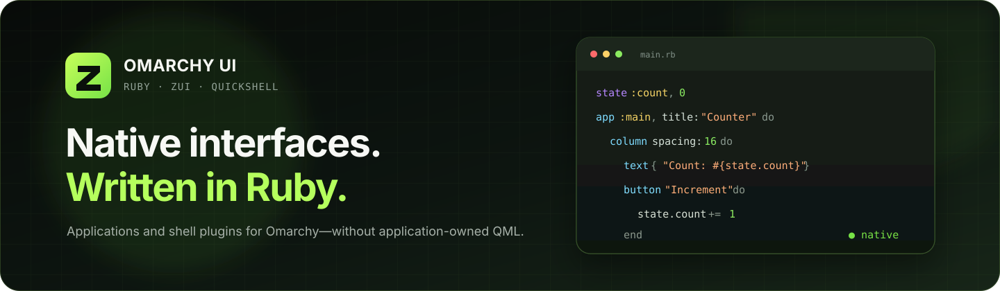
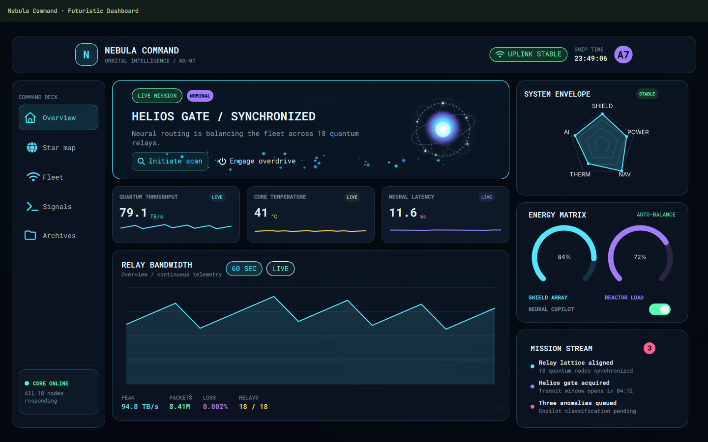

<p align="center">
  
</p>

<h1 align="center">Omarchy UI</h1>

<p align="center">
  <strong>The native Ruby application and plugin adapter for Omarchy.</strong><br>
  Build desktop windows, bar widgets, and shell panels with Zui—without writing application-owned QML.
</p>

<p align="center">
  
  
  
  
  <a href="LICENSE"></a>
</p>

<p align="center">
  <a href="#quick-start">Quick start</a> ·
  <a href="#application-model">Applications</a> ·
  <a href="#omarchy-plugins">Plugins</a> ·
  <a href="#command-line-reference">CLI</a> ·
  <a href="#component-catalog">Components</a> ·
  <a href="#architecture">Architecture</a> ·
  <a href="#development">Development</a>
</p>

---

Omarchy UI connects the platform-neutral [Zui](https://github.com/AdamMusa/zui) framework to
Omarchy and Quickshell. Zui provides the Ruby DSL, state, events, bindings, animation, commands,
rendering protocol, Qt runtime, and complete component catalog. Omarchy UI provides the shell host,
plugin lifecycle, Omarchy surfaces, packaging, and an embedded Ruby runtime.

Applications contain **Ruby and assets only**. QML remains an internal implementation detail of Zui
and the Omarchy adapter.

<table>
  <tr>
    <td width="33%"><strong>Pure Ruby UI</strong><br>Compose native controls, state, events, and application logic in one language.</td>
    <td width="33%"><strong>Two delivery modes</strong><br>Build a normal desktop application or an integrated Omarchy shell plugin.</td>
    <td width="33%"><strong>Verified runtime</strong><br>Ship with a reproducible, checksummed, and GitHub-attested mruby executable.</td>
  </tr>
</table>

> [!IMPORTANT]
> Omarchy UI currently targets **Omarchy on x86-64 Linux**. Reusable Zui application modules can
> also run through Zui's native host on Linux, macOS, and Windows.

## Choose a workflow

| Build | Use it for | Primary surface | Delivery |
| --- | --- | --- | --- |
| Omarchy application | Full desktop tools and standalone interfaces | `app :main` | `omarchy_ui new NAME`, then `run` or `bundle` |
| Omarchy plugin | Bar widgets, panels, and shell-integrated tools | `bar_widget` and `panel` | `omarchy_ui new NAME --plugin`, then `push` or `bundle` |
| Portable Zui application | The same application UI outside Omarchy | `app :main` | The platform-neutral [Zui toolchain](https://github.com/AdamMusa/zui#developer-workflow) |

## Requirements

- Omarchy on x86-64 Linux
- Ruby 3.1 or newer for installation and development
- Qt 6 development tools, CMake, Ninja, and a C++ compiler for `bundle`, `validate`, and `push`
- Optional Qt modules for components that use features such as Quick 3D or Multimedia

Omarchy UI turns Ruby and assets into an Omarchy-compatible application or plugin. It owns the
metadata, entry points, adapter, validation, tree-shaken and AOT-compiled Zui QML, and embedded mruby
runtime. Omarchy UI invokes the build tools; projects do not contain CMake files or distribution
scripts. The finished package does not require Ruby or framework gems. Components report a clear
error when a required Qt module or resource is unavailable.

## Quick start

### 1. Install the adapter

```bash
gem install omarchy-ui
```

The gem installs the compatible Zui version as a dependency.

### 2. Generate a project

```bash
omarchy_ui new Counter
cd counter
```

For an integrated Omarchy plugin instead:

```bash
omarchy_ui new "System Status" --plugin
cd system-status
```

Both commands create a ready-to-run Ruby project. Developers write the interface and behavior;
Omarchy UI generates the Omarchy package without application-owned QML, shell entry points, or
handwritten manifests.

Each project includes a Ruby-native `config.rb` with its type, identity, version, entry point, and
plugin metadata. `bundle`, `validate`, and `push` use this single configuration.

The generator creates a small, host-independent project:

```text
counter/
├── LICENSE
├── app.rb                  # reusable Zui application
├── components/
│   └── welcome.rb          # application-owned Ruby UI module
├── config.rb               # project identity and build settings
├── main.rb                 # Omarchy launcher
└── README.md
```

### 3. Run it

```bash
omarchy_ui run main.rb
```

`run` bundles the project's Ruby entry point, asks Zui to tree-shake the QML runtime, prepares the
Omarchy host, and launches it through Quickshell.

## Application model

Keep the reusable application definition in `app.rb`. UI methods live in a module scoped to that
application, so they do not leak into the global DSL.

```ruby
# app.rb
require "zui"

module Counter
  module UI
    def counter_screen
      container padding: 24 do
        column spacing: 16 do
          text(style: :heading) { "Count: #{state.count}" }
          button("Increment") { state.count += 1 }
        end
      end
    end
  end

  def self.build
    Zui::Application.new(ui: UI) do
      state :count, 0

      app :main, title: "Counter", width: 640, height: 420 do
        counter_screen
      end
    end
  end

  def self.run = build.run
end
```

The Omarchy entry point only selects the host:

```ruby
# main.rb
require "omarchy_ui"
require_relative "app"

OmarchyUI.run(Counter)
```

`OmarchyUI.run` accepts either:

- a module whose `build` method returns a `Zui::Application`; or
- an already-built `Zui::Application` instance.

Because `app.rb` depends on Zui rather than the Omarchy adapter, the same application definition can
use Zui's standard host on [Linux, macOS, or Windows](https://github.com/AdamMusa/zui/blob/main/docs/platforms.md).

### State and bindings

Declare application state before the surfaces that consume it. A block passed to a value component
is a reactive binding; changing the referenced state emits only the native property patches that
actually changed.

```ruby
state :status, "Ready"
state :progress, 0

column spacing: 12 do
  text(style: :heading) { state.status }

  progress_bar = progress 0, minimum: 0, maximum: 100
  bind(progress_bar, :value) { state.progress }
  bind(progress_bar, :visible) { state.progress.positive? }

  button "Start" do
    transaction do
      state.status = "Working"
      state.progress = 12
    end
  end
end
```

Use `bind node, :property` when the reactive value is not the component's primary value. A
`transaction` groups related state assignments so the native host receives one bounded patch batch.

### Events

Action helpers accept a block directly. Use `on` when you need another event exposed by a component.
The handler receives the normalized event payload.

```ruby
query = text_field placeholder: "Search devices"

on query, :submit do |event|
  submitted_query = event.fetch("value", "")
  state.status = "Searching for #{submitted_query}"
end

button("Refresh") { state.status = "Refreshing" }
```

Component schemas define the valid properties and events. Unknown properties, undeclared events,
duplicate IDs, and invalid surface names fail explicitly instead of being silently ignored.

### Reusable UI

Organize larger interfaces with ordinary Ruby modules and methods:

```ruby
module Operations
  module UI
    def metric_card(label, value)
      card padding: 18 do
        text label, color: "#8b8b92"
        text value, style: :heading
      end
    end
  end
end
```

Pass one module or an array of modules through `Zui::Application.new(ui: ...)`. Application-owned
QML is not required.

## Omarchy plugins

Generate a plugin project with one command:

```bash
omarchy_ui new "System Status" --plugin
cd system-status
```

Developers work in Ruby and add their own assets. Omarchy UI supplies the plugin metadata, shell
surfaces, native host, tree-shaken Zui package, validation, and installation lifecycle.

The Ruby entry point uses ordinary Zui components:

```ruby
# main.rb
require "omarchy_ui"

OmarchyUI.plugin do
  state :status, "System ready"

  bar_widget do
    button("Status") { open_panel :status }
  end

  panel :status do
    container padding: 20 do
      column spacing: 12 do
        text(style: :heading) { state.status }
        badge 8
        button("Refresh") { state.status = "Checked just now" }
      end
    end
  end
end
```

`bar_widget` and `panel :status` are the developer-facing surface declarations. Omarchy UI maps them
to the required shell entry points when it builds or stages the plugin.

### Validate and install

```bash
omarchy_ui validate
omarchy_ui push
```

`validate` generates and checks the plugin without modifying the Ruby project. `push` builds,
validates, installs, enables, and reloads it for development.

To publish, target a separate public distribution repository. Omarchy UI rebuilds the thin package,
enforces the marketplace contract, pushes it, and prints the complete submission for review:

```bash
omarchy_ui publish --repo YOUR_GITHUB_NAME/PLUGIN_REPOSITORY \
  --category System --tags system,quickshell --create
```

After reviewing the printed title, metadata, and five marketplace attestations, rerun the same
command with `--submit`. It creates a submission or refreshes an existing open one. This two-step
flow prevents accidental replacement of the source repository and ensures the ownership statement
is reviewed before it is posted.

During development, suppress either lifecycle action when needed:

```bash
omarchy_ui push --no-enable
omarchy_ui push --no-restart
```

## Command-line reference

```text
omarchy_ui <command> [arguments]
```

| Command | Arguments | Result |
| --- | --- | --- |
| `omarchy_ui new NAME` | One project name | Creates an Omarchy application project |
| `omarchy_ui new NAME --plugin --github USER` | One project name, `--plugin`, and optional GitHub user | Creates a marketplace-ready Omarchy plugin project |
| `omarchy_ui run FILE` | One Ruby entry point | Runs an application through the Omarchy/Quickshell host |
| `omarchy_ui bundle [DIRECTORY]` | Zero or one project directory | Generates the distributable package and prints its location |
| `omarchy_ui publish [DIRECTORY]` | Required `--repo`, `--category`, `--tags`; optional `--create`, `--submit` | Builds and pushes a thin distribution repository, then previews or submits its marketplace issue |
| `omarchy_ui validate [DIRECTORY]` | Zero or one plugin directory | Stages the plugin and delegates validation to `omarchy plugin validate` |
| `omarchy_ui push [DIRECTORY]` | Optional `--no-enable` and `--no-restart` | Atomically installs and activates a validated plugin |
| `omarchy_ui version` | None | Prints the installed Omarchy UI version |

When a directory is optional, the current directory is used by default. `run` intentionally does
not forward arbitrary Ruby arguments.

## Packaging

Create the distributable package from the project root:

```bash
omarchy_ui bundle
```

Omarchy UI assembles one bundled Ruby program and required assets, native runtime, manifest, and only
the Zui components used by the project. It AOT-compiles the generated QML into a content-addressed Qt
module, then discards the generated component, control, theme, and font source tree. Applications
receive a direct launcher; plugins must pass Omarchy validation before the command succeeds. Omarchy
UI pins Zui 0.0.10 so the compiled UI matches the Zui core embedded in the deterministic mruby
runtime.

Current Omarchy entry points resolve by filename, so a package retains only the required generated
loader shims. Applications keep `App.qml`; standard plugins keep `Service.qml`, `Panel.qml`, and
`BarWidget.qml`. Each shim contains only an import and a compiled type instance. The application
interface is authored in Ruby and stored in native `.so` artifacts. Distributable packages do not
include generated QML source, build reports, audit/provenance folders, checksums, tests, or CI files.
They also omit `config.rb` and Ruby files already folded into `main.rb`.
Compiled packages should be built against the Qt version shipped by their target Omarchy release.

The source `config.rb` is the build configuration. Omarchy UI generates plugin manifests from it;
developers never maintain a separate manifest.

## Component catalog

Omarchy UI consumes Zui's **241 registered components** without maintaining an adapter-local fork.
Each built-in component has a Ruby builder method, property and event schema, native QML renderer,
reactive patch support, tests, and reference documentation.

| Category | Count | Representative components |
| --- | ---: | --- |
| Foundation and layout | 28 | `container`, `rectangle`, `grid_layout`, `scroll`, `split_view` |
| Display, content, and media | 24 | `text`, `image`, `markdown`, `video`, `model_view_3d` |
| Buttons and input | 36 | `button`, `text_field`, `slider`, `date_picker`, `multi_select` |
| Navigation and structure | 20 | `tabs`, `drawer`, `stack_view`, `breadcrumb`, `pagination` |
| Menus, dialogs, and feedback | 19 | `dialog`, `popup`, `toast`, `progress_ring`, `bottom_sheet` |
| Data and collections | 22 | `list_view`, `grid_view`, `table_view`, `tree_view`, `calendar` |
| Charts and visualization | 16 | `line_chart`, `candlestick_chart`, `heatmap`, `gauge`, `legend` |
| Drawing and interaction | 16 | `canvas`, `shape`, `shader_effect`, `drag_area`, `particle_system` |
| Animation, state, and timing | 32 | `animation`, `transition`, `timer`, `state_group`, `spring_animation` |
| Effects | 7 | `multi_effect`, `blur`, `drop_shadow`, `colorize`, `glow` |
| Multimedia and capture | 12 | `media_player`, `camera`, `audio_input`, `video_output`, `screen_capture` |
| Models and utilities | 9 | `list_model`, `settings`, `clipboard`, `standard_paths` |

- [Complete Zui component coverage matrix](https://github.com/AdamMusa/zui/blob/main/docs/component-coverage.md)
- [Zui platform support](https://github.com/AdamMusa/zui/blob/main/docs/platforms.md)
- [Omarchy QML ownership boundary](docs/qml-support.md)

## Showcase applications

The synchronized [showcase catalog](examples/) demonstrates complete Ruby applications rather than
isolated component previews.

<p align="center">
  <a href="examples/futuristic_dashboard/">
    
  </a><br>
  <sub><strong>Nebula Command</strong> · A complete orbital-operations dashboard written in Ruby.</sub>
</p>

| Showcase | What it demonstrates |
| --- | --- |
| **[Nebula Command](examples/futuristic_dashboard/)** | **Featured:** telemetry, effects, SVG assets, navigation, controls, and charts |
| [Tesla Drive Lab](examples/tesla_drive_dashboard/) | Vehicle state, canvas maps, gauges, charts, media, and scheduled telemetry |
| [Nova Pour](examples/nova_pour/) | Image-backed ordering, live status, dialog flows, and responsive composition |
| [Lumen Forge](examples/lumen_forge/) | GPU shaders, reactive uniforms, pointer input, and Qt 6's graphics pipeline |
| [Pulse Atlas](examples/cardiac_health_monitor/) | Health visualization, charts, gauges, particles, heatmaps, and scheduled state |
| [Nocturne](examples/cinematic_music_studio/) | Qt Multimedia playback, seeking, track navigation, mixing controls, and reordering |
| [Stratos](examples/orbital_weather_console/) | Reactive image effects, radar data, area charts, heatmaps, and briefing dialogs |
| [Quantum Market](examples/quantum_market_terminal/) | Tables, candlesticks, simulated orders, positions, allocation, and risk state |
| [Habitat One](examples/smart_home_energy/) | Smart-home simulation, scenes, energy charts, comfort heatmaps, and automation |

Run any showcase from the repository root:

```bash
omarchy_ui run examples/tesla_drive_dashboard/main.rb
```

## Architecture

```text
Application Ruby and assets
          │
          ▼
Zui DSL · state · events · bindings · scheduler
          │
          │ versioned JSON render, patch, event, and effect protocol
          ▼
Omarchy process bridge ───────────────── embedded mruby runtime
          │
          ▼
Tree-shaken Zui host + component catalog
          │
          │ bundle: Qt AOT module + required loader shims
          │
          ▼
App window · Omarchy panel · Omarchy bar widget
          │
          ▼
Qt Quick / Controls / Multimedia / optional modules
```

The dependency direction is deliberate:

- **Zui owns** the component registry, Ruby builders, state engine, protocol, renderer, neutral
  controls and theme, and native catalog.
- **Omarchy UI owns** `App.qml`, `Service.qml`, `Panel.qml`, `BarWidget.qml`, the Quickshell
  integration, plugin lifecycle commands, and Omarchy packaging.
- **Applications own** Ruby source, assets, state, behavior, and reusable UI modules.

At bundle, validation, and push time, Omarchy UI asks Zui to analyze the bundled Ruby syntax and
generate only the required component adapters plus their renderer dependencies. Omarchy UI overlays
its host, compiles the complete generated QML graph into a content-addressed Qt module, and emits the
minimal loader files required by Omarchy. Read the full [QML ownership and adapter
boundary](docs/qml-support.md).

## Runtime integrity

The x86-64 Linux mruby runtime is produced by a pinned GitHub Actions workflow that:

1. checks out every external input at a full commit digest;
2. performs two clean builds in separate cache directories;
3. requires byte-identical executables;
4. publishes the executable and SHA-256 checksum; and
5. creates a signed GitHub artifact attestation for the resulting digest.

Verify a published runtime independently:

```bash
gh release download runtime-v0.1.4 \
  --repo AdamMusa/omarchy-ui \
  --pattern 'omarchy-ui-runtime*'

sha256sum --check omarchy-ui-runtime.sha256
gh attestation verify omarchy-ui-runtime --repo AdamMusa/omarchy-ui
```

See [runtime build and verification](docs/runtime-build.md) for the pinned source revisions,
reproduction steps, and provenance contract.

The mruby host records a bounded local audit event when an Omarchy UI plugin launches `curl` or
`wget` through `Zui::Command`. Each event contains the method, a URL with credentials, query, and
fragment removed, the process exit result, response byte count, and duration. Headers and response
bodies are never recorded. Per-plugin logs rotate at 128 KiB under
`~/.local/state/omarchy-ui-audit/`; this is local observability for Plugin Pulse, not telemetry.

## Troubleshooting

| Symptom | Check |
| --- | --- |
| `Ruby file not found` | Pass an existing entry point to `omarchy_ui run`, normally `main.rb` |
| `Omarchy QML module not found` | Confirm the Omarchy shell installation provides `/usr/share/omarchy/shell/Commons` and `Ui` |
| A component reports a missing module | Install or enable the Qt module required by that declared component |
| Plugin validation fails | Run `omarchy_ui validate` and correct the reported Ruby, asset, or generated-metadata error before pushing |
| A pushed plugin is installed but inactive | Run `omarchy plugin enable <id>` and `omarchy restart shell` after resolving the reported shell error |
| The bundle destination already exists | Review or move the previously generated package before bundling again |

Omarchy UI reports unsupported properties, components, events, paths, generated metadata, and runtime
resources directly. Preserve the original error when opening an issue.

## Development

Clone Zui and Omarchy UI as sibling repositories, then run the adapter's complete test script:

```bash
git clone https://github.com/AdamMusa/zui.git
git clone https://github.com/AdamMusa/omarchy-ui.git
cd omarchy-ui

ZUI_SOURCE_DIR=../zui scripts/test.sh
```

The test script verifies the Ruby adapter, CLI lifecycle, framework boundary, synchronized showcase
applications, source syntax, gemspec, runtime checksum when present, and QML formatting/linting when
the corresponding Qt tools are available.

Use the repository-local command without installing a gem:

```bash
ZUI_SOURCE_DIR=../zui ruby -Ilib bin/omarchy_ui version
ZUI_SOURCE_DIR=../zui ruby -Ilib bin/omarchy_ui run examples/nova_pour/main.rb
```

Framework, DSL, protocol, and component changes belong in
[Zui](https://github.com/AdamMusa/zui). Omarchy host integration, shell lifecycle, adapter QML,
runtime packaging, and synchronized Omarchy showcases belong here.

## Project reference

| Resource | Purpose |
| --- | --- |
| [Zui documentation](https://github.com/AdamMusa/zui#readme) | Core Ruby API, platform workflow, and framework architecture |
| [Component coverage](https://github.com/AdamMusa/zui/blob/main/docs/component-coverage.md) | Complete list of registered native components |
| [QML boundary](docs/qml-support.md) | Ownership and dependency direction between Zui and Omarchy UI |
| [Runtime provenance](docs/runtime-build.md) | Reproducible build inputs, checksum, attestation, and verification |
| [Showcase catalog](examples/) | Complete application examples and their run instructions |
| [Issue tracker](https://github.com/AdamMusa/omarchy-ui/issues) | Bug reports and focused feature proposals |

## License

Omarchy UI is available under the [MIT License](LICENSE).

<p align="right"><a href="#omarchy-ui">Back to top ↑</a></p>
